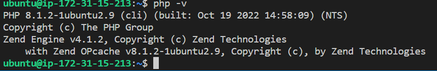
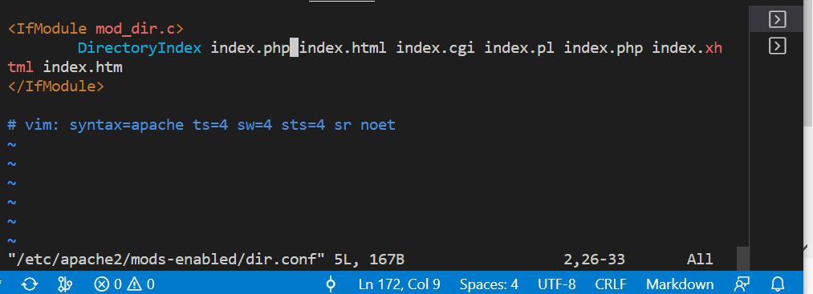

## Installing Apache using Ubuntu's package manager 'apt'
### Update a list of packages in package manager
`sudo apt update`
### run apache2 package installation command
`sudo apt install apache2`

### To verify that apache2 is running
`sudo systemctl status apache2`

Security group modification to allow traffic from the web to our webserver on the EC2 instance

To test local access, run code below on terminal:
`curl http://localhost:80`

To test how our Apache HTTP server can respond to requests from the Internet, we use a url of the format: 
http://<Public-IP-Address>:80

To retrivel the public IP from the terminal, run:
`curl -s http://169.254.169.254/latest/meta-data/public-ipv4`

On the browser the page below can be seen:

##  Step 2 - Installing MYSQL
Now that we have a web server up and running, we will install a Database Management System (DBMS) to be able to store and manage data for our site in a relational database. MySQL is a popular relational database management system used within PHP environments, so we will use it in our project

Use 'apt' to install MYSQL

`sudo apt install mysql-server`

When prompted, confirm installation by typing Y, and then ENTER.

When the installation is finished, log in to the MySQL console by typing:
`sudo mysql`

It’s recommended that we run a security script that comes pre-installed with MySQL. This script will remove some insecure default settings and lock down access to your database system. Before running the script we will set a password for the root user, using mysql_native_password as default authentication method. We’re defining this user’s password as PassWord.1

`mysql> ALTER USER 'root'@'localhost' IDENTIFIED WITH mysql_native_password BY 'Password@1';`

Start the interactive script by running:

`sudo mysql_secure_installation`

This will ask if we want to configure the VALIDATE PASSWORD PLUGIN.

Note: Enabling this feature is something of a judgment call. If enabled, passwords which don’t match the specified criteria will be rejected by MySQL with an error. It is safe to leave validation disabled, but you should always use strong, unique passwords for database credentials.

Answer Y for yes, or anything else to continue without enabling.

If you answer “yes”, you’ll be asked to select a level of password validation. Keep in mind that if you enter 2 for the strongest level, you will receive errors when attempting to set any password which does not contain numbers, upper and lowercase letters, and special characters, or which is based on common dictionary words e.g PassWord.1.

For the rest of the questions, press Y and hit the ENTER key at each prompt. This will prompt you to change the root password, remove some anonymous users and the test database, disable remote root logins, and load these new rules so that MySQL immediately respects the changes you have made.

When you’re finished, test if you’re able to log in to the MySQL console by typing:

`sudo mysql -p`

Notice the -p flag in this command, which will prompt you for the password used after changing the root user password.

To exit the MySQL console, type:

`mysql> exit`

## STEP 3 — INSTALLING PHP

PHP is the component of our setup that will process code to display dynamic content to the end user. In addition to the php package, you’ll need php-mysql, a PHP module that allows PHP to communicate with MySQL-based databases. You’ll also need libapache2-mod-php to enable Apache to handle PHP files. Core PHP packages will automatically be installed as dependencies.

To install these 3 packages at once, run:

`sudo apt install php libapache2-mod-php php-mysql`

Confirm installation of php with: 

`php -v`

At this point, THE LAMP stack is completely installed and fully operational.

Linux (Ubuntu)
Apache HTTP Server
MySQL
PHP
To test the setup with a PHP script, it’s best to set up a proper Apache Virtual Host to hold our website’s files and folders. Virtual host allows us to have multiple websites located on a single machine and users of the websites will not even notice it.

## STEP 4 — CREATING A VIRTUAL HOST FOR YOUR WEBSITE USING APACHE

Apache on Ubuntu 20.04 has one server block enabled by default that is configured to serve documents from the /var/www/html directory.
We will leave this configuration as is and will add our own directory next next to the default one.

Create the directory for projectlamp using ‘mkdir’ command as follows:

`sudo mkdir /var/www/projectlamp`

Next, assign ownership of the directory with your current system user:

`sudo chown -R $USER:$USER /var/www/projectlamp`

Then, create and open a new configuration file in Apache’s sites-available directory using your preferred command-line editor. Here, we’ll be using vi or vim (They are the same by the way):

`sudo vi /etc/apache2/sites-available/projectlamp.conf`

This will create a new blank file. Paste in the following bare-bones configuration by hitting on i on the keyboard to enter the insert mode, and paste the text:

`<VirtualHost *:80>
    ServerName projectlamp
    ServerAlias www.projectlamp 
    ServerAdmin webmaster@localhost
    DocumentRoot /var/www/projectlamp
    ErrorLog ${APACHE_LOG_DIR}/error.log
    CustomLog ${APACHE_LOG_DIR}/access.log combined
</VirtualHost>`

You can use the ls command to show the new file in the sites-available directory

`sudo ls /etc/apache2/sites-available`

You will see something like this;

`000-default.conf  default-ssl.conf  projectlamp.conf`

With this VirtualHost configuration, we’re telling Apache to serve projectlamp using /var/www/projectlampl as its web root directory. If you would like to test Apache without a domain name, you can remove or comment out the options ServerName and ServerAlias by adding a # character in the beginning of each option’s lines. Adding the # character there will tell the program to skip processing the instructions on those lines.

You can now use a2ensite command to enable the new virtual host:

`sudo a2ensite projectlamp`

You might want to disable the default website that comes installed with Apache. This is required if you’re not using a custom domain name, because in this case Apache’s default configuration would overwrite your virtual host. To disable Apache’s default website use a2dissite command , type:

`sudo a2dissite 000-default`

To make sure your configuration file doesn’t contain syntax errors, run:

`sudo apache2ctl configtest`

Finally, reload Apache so these changes take effect:

`sudo systemctl reload apache2`

Your new website is now active, but the web root /var/www/projectlamp is still empty. Create an index.html file in that location so that we can test that the virtual host works as expected:

sudo echo 'Hello LAMP from hostname' $(curl -s http://169.254.169.254/latest/meta-data/public-hostname) 'with public IP' $(curl -s http://169.254.169.254/latest/meta-data/public-ipv4) > /var/www/projectlamp/index.html

Now go to your browser and try to open your website URL using IP address:

http://<public_ipv4>:80

If you see the text from ‘echo’ command you wrote to index.html file, then it means your Apache virtual host is working as expected.
In the output you will see your server’s public hostname (DNS name) and public IP address. You can also access your website in your browser by public DNS name, not only by IP – try it out, the result must be the same (port is optional)

http://<Public-DNS-Name>:80

You can leave this file in place as a temporary landing page for your application until you set up an index.php file to replace it. Once you do that, remember to remove or rename the index.html file from your document root, as it would take precedence over an index.php file by default.

## STEP 5 — ENABLE PHP ON THE WEBSITE

With the default **DirectoryIndex** settings on Apache, a file named index.html will always take precedence over an index.php file. This is useful for setting up maintenance pages in PHP applications, by creating a temporary index.html file containing an informative message to visitors. Because this page will take precedence over the index.php page, it will then become the landing page for the application. Once maintenance is over, the index.html is renamed or removed from the document root, bringing back the regular application page.

To change this behavior, we’ll need to edit the **/etc/apache2/mods-enabled/dir**.conf file and change the order in which the **index.php** file is listed within the **DirectoryIndex** directive:

`sudo vim /etc/apache2/mods-enabled/dir.conf`

`<IfModule mod_dir.c>
        #Change this:
        #DirectoryIndex 
        index.html index.cgi index.pl index.php index.xhtml index.htm
        #To this:

        DirectoryIndex index.php index.html index.cgi index.pl index.xhtml index.htm
</IfModule>`

After saving and closing the file, you will need to reload Apache so the changes take effect:

`sudo systemctl reload apache2`

Finally, we will create a PHP script to test that PHP is correctly installed and configured on your server.

Now that you have a custom location to host your website’s files and folders, we’ll create a PHP test script to confirm that Apache is able to handle and process requests for PHP files.

Create a new file named index.php inside your custom web root folder:

`vim /var/www/projectlamp/index.php`

This will open a blank file. Add the following text, which is valid PHP code, inside the file:

**<?php**

**phpinfo();**

When you are finished, save and close the file, refresh the page and you will see a page similar to this:

PHP installation is working as expected.

After checking the relevant information about the PHP server through that page, it’s best to remove the file you created as it contains sensitive information about your PHP environment -and your Ubuntu server. You can use rm to do so:

`sudo rm /var/www/projectlamp/index.php`

