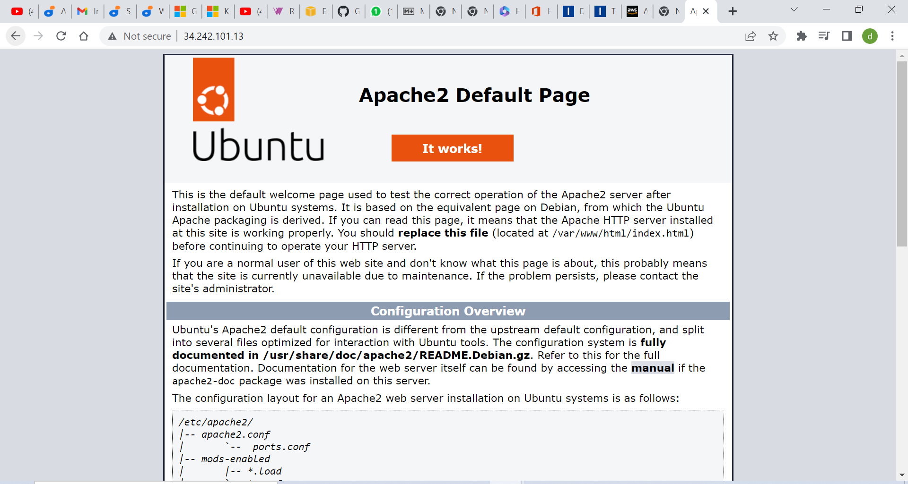

## Installing Apache using Ubuntu's package manager 'apt'
### Update a list of packages in package manager
`sudo apt update`
### run apache2 package installation command
`sudo apt install apache2`

### To verify that apache2 is running
`sudo systemctl status apache2`

Security group modification to allow traffic from the web to our webserver on the EC2 instance

To test local access, run code below on terminal:
`curl http://localhost:80`

To test how our Apache HTTP server can respond to requests from the Internet, we use a url of the format: 
http://<Public-IP-Address>:80

To retrivel the public IP from the terminal, run:
`curl -s http://169.254.169.254/latest/meta-data/public-ipv4`

On the browser the page below can be seen:

## Installing MYSQL
Now that we have a web server up and running, we will install a Database Management System (DBMS) to be able to store and manage data for our site in a relational database. MySQL is a popular relational database management system used within PHP environments, so we will use it in our project

Use 'apt' to install MYSQL

`sudo apt install mysql-server`

When prompted, confirm installation by typing Y, and then ENTER.

When the installation is finished, log in to the MySQL console by typing:
`sudo mysql`

It’s recommended that we run a security script that comes pre-installed with MySQL. This script will remove some insecure default settings and lock down access to your database system. Before running the script we will set a password for the root user, using mysql_native_password as default authentication method. We’re defining this user’s password as PassWord.1

`mysql> ALTER USER 'root'@'localhost' IDENTIFIED WITH mysql_native_password BY 'Password@1';`

Start the interactive script by running:

`sudo mysql_secure_installation`

This will ask if we want to configure the VALIDATE PASSWORD PLUGIN.

Note: Enabling this feature is something of a judgment call. If enabled, passwords which don’t match the specified criteria will be rejected by MySQL with an error. It is safe to leave validation disabled, but you should always use strong, unique passwords for database credentials.

Answer Y for yes, or anything else to continue without enabling.

If you answer “yes”, you’ll be asked to select a level of password validation. Keep in mind that if you enter 2 for the strongest level, you will receive errors when attempting to set any password which does not contain numbers, upper and lowercase letters, and special characters, or which is based on common dictionary words e.g PassWord.1.

For the rest of the questions, press Y and hit the ENTER key at each prompt. This will prompt you to change the root password, remove some anonymous users and the test database, disable remote root logins, and load these new rules so that MySQL immediately respects the changes you have made.

When you’re finished, test if you’re able to log in to the MySQL console by typing:

`sudo mysql -p`

Notice the -p flag in this command, which will prompt you for the password used after changing the root user password.

To exit the MySQL console, type:

`mysql> exit`

